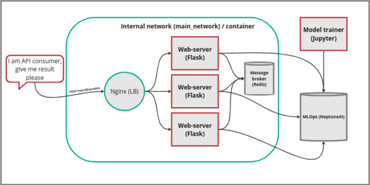

# hse_mlc_final

### Prerequisites

Python 3.10
NeptuneAI API token

### High-level overview

We use Nginx as **loadbalancer** (only loadbalancer has access to external world), **3 replicas of the server** to decrease downtime and for fault tolerance, **Redis** is used as message broker integration for **Celery asynchronouus tasks** (we download new model weights asyncronously in order to unblock API provisioning), the **Neptune AI integration** is used both in runtime and in trainer stage in **Jupyter**, Neptune AI is used for monitoring and as a model and version registry.



Current project is a final task.

Problem we are solving is Multi-label classification task based on eCommerce data. The goal is to predict correctly the categories by text (NLP problem). We use BERT-like pre-trained model and transfer learning technique to apply necessary changes on the head of the model to conform to our predicition task.

**Model description**
BERT-like model from Hugginface (`bert-base-cased`) with tokenizer to solve NLP multi-label classification task. Number of classes is 15 that's reflected in updated head of the model. We use transfer learning approach.

**Dataset**
eCommerace dataset containing products, categories and sub-categories of different products. Other information is available too but we are mostly interested in `description` and category columns that we are our targets.
The dataset can be checked in the Jupyter notebook.

**Input**

```json
{
  "text": "alongside lovely cartoon character design, innovative snackeez snacking solution allows drink water favourite snack one hand. cup stay perfectly sealed prevent spill keep snack fresh."
}
```

**Output**

```json
{ "predicted_categories": ["Kitchen", "Garden & Pets"] }
```

**Runtime architecture**
First step is to train a model in Jupyter notebook (`trainer.ipynb`).

```bash
jupyter notebook
```

Since it can require some resources, you probably want to run it somewhere in the cloud with GPU support. For this purpose there is starting section with installations that can help to setup local envronment in the cloud (getting the repo archive, installing packages etc).
Feel free to choose whaterver option works better.

As part of the Jupyter the model weights are saved for the first time. On the second and further training cycles the `best` model will be compared to each run and after the evaluation is performed it is decided what model weights (along with other parameters) is saved in NeptuneAI integration.

When the `best` model is present, the web-server can be started and the predictions can be checked by making an API call.

The web-servers starts from downloading the model weights available under `best` tag in NeptuneAI. This is the **blocking task** since our web-server is integration-dependent and requires at least one model being present in the aforementioned integration. Thus Jupyter steps mentioned above are required to start the web-server later.
Each API call will be happening alongside the Celery task that's going to check whether the currently available `best` model is still the best. If not, the asynchronous task to download the model is going to start (since it can take some time). We did it in such a way in order to **unblock the API consuming** for customers thus once the new best model weights are available on the hard drive, we setup the model for next incoming API calls with new weights.

Finally, the request is happening and predictions results mapped to the categories is returned back.

### Local server with full installation

After cloning the repository do next steps on your local machine inside the cloned folder:

1. Initiate virtual environment with python3.10

```bash
python3.10 -m venv hse_mlc_final
```

Do all necessary steps (moving files so that finally you have whole project with virtual environment setup)

2. Activate virtual environment

```bash
source ./bin/activate
```

3. Install packages

```bash
pip install -r requirements.txt
```

4. Set configurations (src/config.py) for Neptune AI connection

```bash
API_TOKEN=<YOUR_TOKEN>
PROJECT_NAME=<YOUR_PROJECT_NAME>
BROKER_URL=<YOUR_BROKER_URL>
```

For broker URL you might priobably want to start local Redis instance

```bash
docker run -d --name queue -p 6379:6379 redis
```

Then you can set `BROKER_URL=redis://localhost:6379`

5. Start local server

```bash
flask --app src/app run
```

6. Send request to get prediction result

```bash
curl -X POST http://127.0.0.1:5000/predict -d '{"text":"alongside lovely cartoon character design, innovative snackeez snacking solution allows drink water favourite snack one hand. cup stay perfectly sealed prevent spill keep snack fresh."}' -H 'Content-Type: application/json'
```

Example response: `{"predicted_categories":["Kitchen","Garden & Pets"]}`

7. Play around with any text taken from Jupyter Notebook from `X_test` set. The field for text data that's provided as input to the API is `description` so `X_test['description].loc[<index>]` should give you some text to check the prediction for.

### Production-ready setup

**Attention**: Performance (request / response cycle) is much larger when using Redis from Docker. We have tried to figure this out but the problem seems to be related to network communication inside Docker. In real cluster, real redis would be used so it would be much faster. If you want to test the speed of request / response, feel free to use local installation steps from above otherwise be patient and please know that the performance problems are related to Redis and Docker interaction.

1. Update `BROKER_URL` from `src/config.py`
   `BROKER_URL = "redis://queue:6379"`
   That is needed for referencing the host directly from the doker container name.

2. Run `docker-compose up --build`

3. Wait for first server being available and then run

```bash
curl -X POST http://127.0.0.1:5000/predict -d '{"text":"alongside lovely cartoon character design, innovative snackeez snacking solution allows drink water favourite snack one hand. cup stay perfectly sealed prevent spill keep snack fresh."}' -H 'Content-Type: application/json'
```

Example response: `{"predicted_categories":["Kitchen","Garden & Pets"]}`
